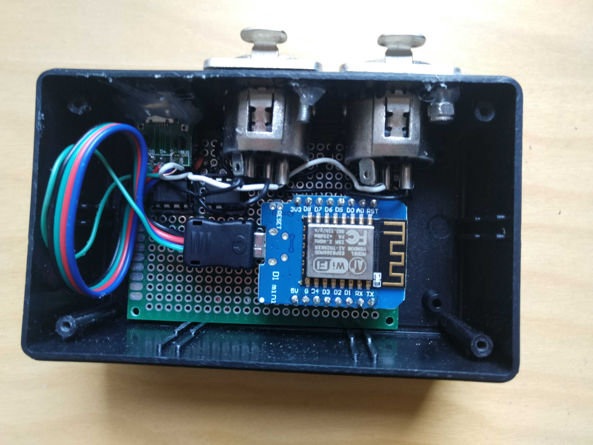
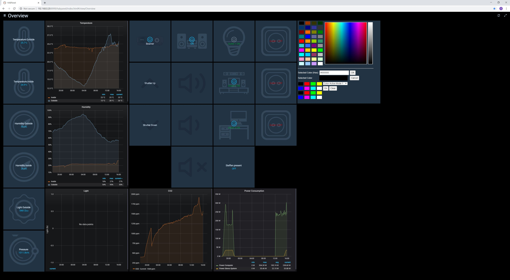

# Smart Home Project with ESP8266 and Attiny85
A few simple sketches for ESP8266 and ATTiny micro controllers and controller boards with different sensors or for controlling actuators. 
Integration can be done via MQTT over WiFi. 

The sketches include code for ESP8266 controllers for doing the following tasks:

* Reading the temperature and humditiy from an DHT22 sensor and transmitting it over MQTT as JSON over WiFi to an MQTT Message Broker.
* Reading the CO2 value from a MH Z19 Sensor and transmitting it over MQTT as JSON over WiFi to an MQTT Message Broker.
* Receiving 433Mhz radio signals and transmitting the received signals over MQTT as JSON over WiFi to an MQTT Message Broker.
* Controlling a 32x8 LED Matrix
* Controlling a Reed Relay based on inputs from an MQTT channel as JSON to open and close the relay
* Reading the value from a simple door sensor and transmitting it over MQTT as JSON over WiFi to an MQTT Message Broker.
* Controlling two seperate DMX universes with signals received from an MQTT channel as JSON or as binary messages via WiFi (see picture below).
* Controling shutters via a HTTP web interface
* Reading the light level from a BH1750 sensor
* A small weather station with both a DHT22 and a BH1750 sensor, connected via MQTT over WiFi
* A low power consumption Attiny85 sketch for a door sensor that transmits the sensor value via 433Mhz radio.
* A low power weather station with both a DHT22 and BH1750 which transmits the sensor data via 433Mhz radio.

Additionally, there is an openhab application weith integrated grafana charts set up to provide a user interface and automation rules for all the devices and more. Feel free to contact me for details on this!

# Device Overview
The detailed information about to which GPIO ports of the controllers to connect the sensors is provided within the corresponding project folder in this repository.

##== Lamp 01 ==
Receives commands via MQTT channel /device/lamp/01  
update state: send `{"type":  "update", "r": 800, "g":  600, "b": 400, "m": 1024}` via MQTT, values are 10-bit integers [0, 1024]  
read state: send `{"type": "status"}` via MQTT, result will be shown at /device/lamp/01/output
-> runs on ESP8266  

##== Weather Outside == 
WeatherOutside sends MQTT: /sensor/weather/outside: `{"light": 15, "temperature": 29.10, "humidity": 34.90}`, light: lux, temperature: celsius, humidity: percent  
-> runs on ESP8266   

##== Weather Bathroom == 
WeatherInsideBathroom sends MQTT: /sensor/weather/inside/bathroom: `{"t": 27.40, "h": 38.50, "l": 4.00}`, l: light level in lux, t: temperature in celsius, h: humidity in percent  
-> runs on ESP8266  

##== Weather Inside == 
WeatherInside sends MQTT: /sensor/weather/inside: `{"temperature": 22.7, "humidity": 18.2}`, temperature: temperature in celsius, humidity: humidity in percent  
-> runs on ESP8266  

##== CO2 Inside ==
CO2Inside sends MQTT: /sensor/co2Inside: `{"co2": 671}` CO2-Value in PPM  
-> runs on ESP8266 and reads local MH-/19B sensor using SoftwareSerial  

##== 433MhzReceiver ==
Receives 433mhz and sends to MQTT: /device/433Mhz/receive: `{"value": 5396}`  
-> runs on ESP8266 with 433mhz receive module  

##== Door Sensor ==
Sends 433mhz signal when door is opened/closed:  
-> 21777 when closed  
-> 21780 when opened  
433mhz signal is then received by 433MhzReceiver and put on Mqtt, where openhab reads it and transforms it into DoorState (0 for closed, 1 for opened).  
-> runs on Attiny with 433mhz transmit module  

##== Shutter Controller ==
ShutterController: receives + sends MQTT on /devices/shutter  
-> runs on ESP8266  
messages:  
/devices/shutter - `{"type": "update", "stat": <s>}` - sent from a client to move the shutter up/down: s=1: up, s=2: down  
/devices/shutter - `{"type": "response","result":"<msg>"}` - sent from the controller after received an update message with stat=1: msg = "moving up" or 2: msg="moving down"  
/devices/shutter - `{"type": "whois"}` - makes everyone on this channel resend their JOIN-Message TODO: move to /meta/devices channel  

##== DMX Controller ==
/devices/dmx - `{"type": "update", "chn": 1, "val": 255, "univ": 1}` - update message sent from a client to update dmx-channel <chn>[1-512] and set the value <val> [0-255] for a universe <univ> [1,2].   
If univ=2, both universes are updated.  
If chn=0, the selected universe is nulled.  
/devices/dmx - `{"type": "response", "chn":1,"val":255,"univ":1}` - sent from controller after an update-message had been received and the value of the channel in the universe had been updated  
/devices/dmxB - xxx yyy zzz - Binary Protocol: xxx: channel, yyy: value, zzz: universe  

sendable:  
/meta/sensors: `{"type":"whois"}` returns active-messages  
/meta/devices: `{"type":"whois"}` returns active-messages  

##== Raspberry Pi ==

###-- Weather Inside --
WeatherInside sends MQTT: /sensor/weather/inside: {"temperature": 29.10, "humidity": 34.90}, temperature: celsius, humidity: percent  
-> runs on RaspberryPi as Python Script which reads local DHT sensor using Adafruit DHT  

###-- Pressure Inside --
PressureInside sends MQTT: /sensor/weather/inside/pressure: {"temperature": 25.7, "pressure": 100516.0, "altitude": 100516.0, "sealevel-pressure": 100516.0  
-> runs on RaspberryPi as Python Script which reads local BMP sensor using Adafruit BMP  

###-- IR Controller --
IRController + 433MhzController run on RaspberryPi as Python Script which receives JSON messages via MQTT and executes a command to irsend or home/git/raspberry-remote/send  
-> IRController.py  
-> 433MhzController.py  
-> WeatherInside.py  
--> started by /etc/init.d/effectivehome20 on startup  
